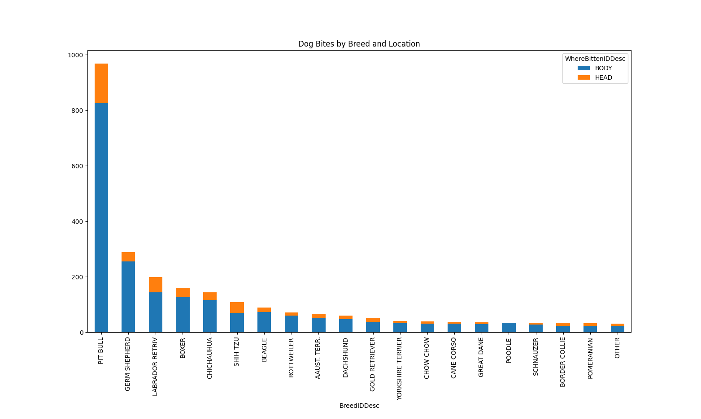

# Recorded Animal Bites

## Table of contents
* [About](#about)
    * [Motivation](#motivation)
* [Screenshots](#screenshots)
* [Dataset](#dataset)
    * [Project Links](#project-links)
* [Contact](#contact)
    

## About
As an aspiring data scientist, I wanted to learn more about the industry standards for data analysis techniques. I have prior analysis experience using JavaScript and Excel/Sheets; however, companies heavily rely on programs such as Python, R, and Tableau to complete their analyses and dashboards. Doing these projects allows me to strengthen my skills in these programs while creating a presentable output.

I created the same plots using multiple programs, *Tableau* and *Python*, to broaden my skill set and understand the difference between the two.

### Motivation
When I went to [Kaggle](https://www.kaggle.com/) to look for a beginning dataset to use, I wanted to start with a topic that I was passionate about. I've always been interested in the unique traits found in different dog breeds. I found a dataset about reported animal bites which allowed me to look into some of the more negative traits found in animals.
## Prerequisites

Tableau Desktop 2024.1

Python 3.12.4

**Python Packages:**

    matplotlib      3.9.0

    numpy           2.0.0

    packaging       24.1

    pandas          2.2.2

    pyparsing       3.1.2

    python-dateutil 2.8.2

    pip             24.1

    pytz           2020.1

    tzdata         2022.7

## Screenshots

## Dataset
Dataset was provided by [Kaggle](https://www.kaggle.com/datasets/rtatman/animal-bites/data). 

This dataset contains 9,003 rows with 10 columns where each row is one animal bite incident. The 10 columns presented each bites location and date but also included animal information such as species, breed, color, etc. 

### Project Links:

#### [Python](https://github.com/nasadourian/Animal_Bites/tree/main/python)

#### [Tableau](https://github.com/nasadourian/Animal_Bites/tree/main/tableau)

## Contact

Nanor Asadourian - nanor.asadourian@gmail.com