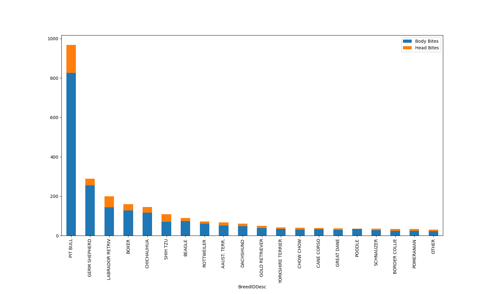
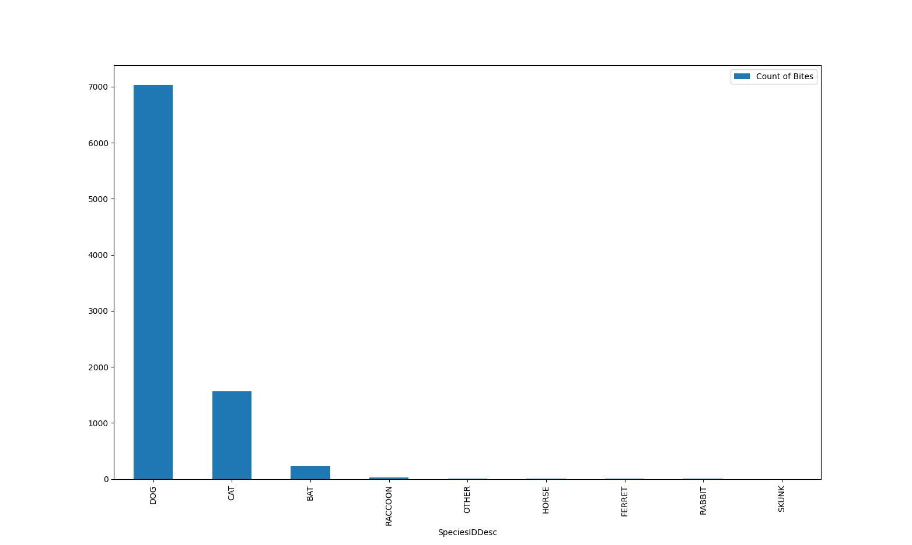
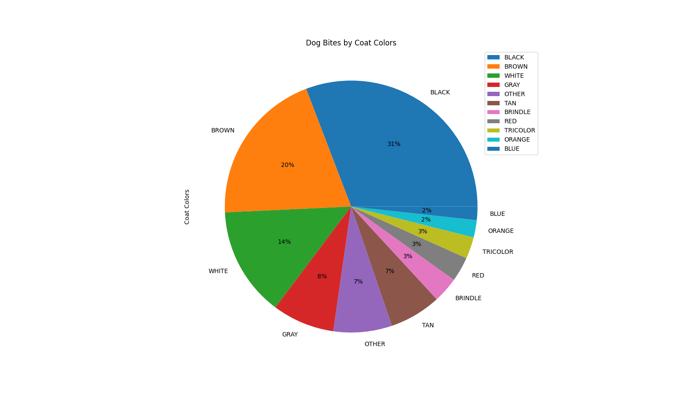
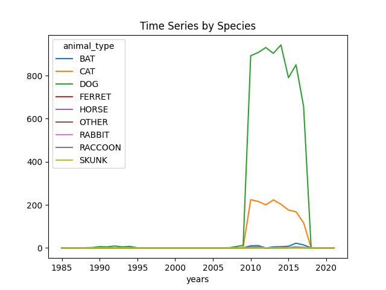

# Animal Bites

## Table of contents
* [About](#about)
    * [Motivation](#motivation)
    * [What I Learned](#what-i-learned) 
* [Setup](#setup)
    * [Technologies Used](#technologies_used)
    * [Prerequisites](#prerequisites)
    * [Installation](#installation)
* [Screenshots](#screenshots)
* [Dataset](#dataset)
* [Contact](#contact)

## About

I created this using Python 3.12.4. 

### Motivation

Initially, this project started  in Tableau, but upon finishing my Dashboard, I wanted to continue learning data analysis with the same dataset. I decided to recreate the plots in Python so I had an expected output. 

### What I Learned

* Read a .csv file into Python,

* Create a dataFrame and Series from a dataset and how to manipulate each, 

* Reformat data in a dataFrame to make analysis easier, 

* Use dateTimeIndex to convert dates into dateTime objects, 

* Compute calculations based on various column values,  

* Group data using multiple indices,

* Filter data using inclusions and exclusions,

* Plot data using a variety of charts including bar charts (normal and stacked ), line charts, and pie charts, etc, and

* Update dataFrames to reflect changes done to clean said dataset

## Setup

### Technologies Used
Python 3.12.4

### Prerequisites 

### Installation 
---

## Screenshots

## Dataset
Dataset was provided by [Kaggle](https://www.kaggle.com/datasets/rtatman/animal-bites/data). 

This dataset contains 9,003 rows with 10 columns where each row is one animal bite incident. The 10 columns presented each bites location and date but also included animal information such as species, breed, color, etc. 

## Contact

Nanor Asadourian - nanor.asadourian@gmail.com