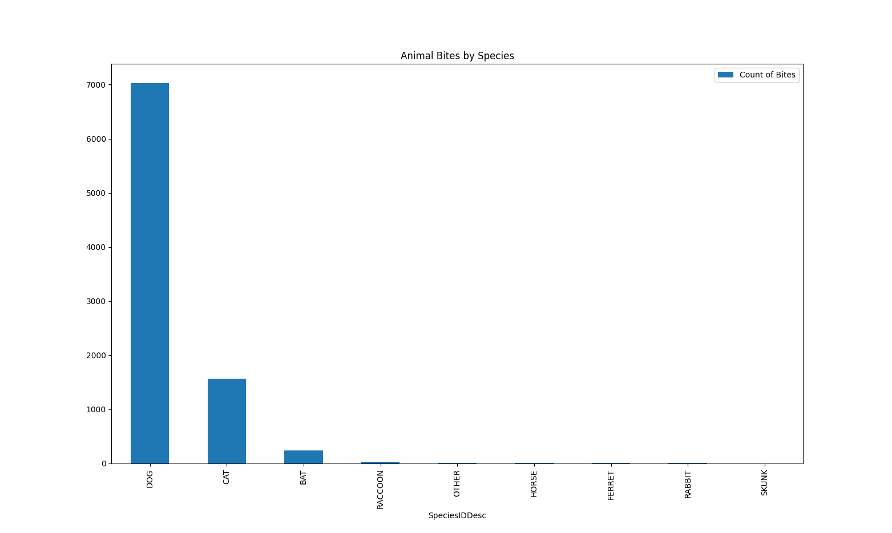

# Animal Bites

## Table of contents
* [About](#about)
    * [Motivation](#motivation)
    * [What I Learned](#what-i-learned) 
* [Setup](#setup)
    * [Installation](#installation)
    * [Usage](#usage)
* [Screenshots](#screenshots)
    * [Analysis Summary](#analysis-summary)
* [Dataset](#dataset)
* [Contact](#contact)

## About

I created this using Python 3.12.4. 

### Motivation

Initially, this project started  in Tableau, but upon finishing my Dashboard, I wanted to continue learning data analysis with the same dataset. I decided to recreate the plots in Python so I had an expected output. 

### What I Learned

* Read a .csv file into Python,

* Create a dataFrame and Series from a dataset and how to manipulate each, 

* Reformat data in a dataFrame to make analysis easier, 

* Update dataFrames to reflect changes done to clean said dataset,

* Use dateTimeIndex to convert dates into dateTime objects, 

* Compute calculations based on various column values,  

* Group data using multiple indices,

* Filter data using inclusions and exclusions,

* Transform a groupby dataframe using unstack, and

* Plot data using a variety of charts including bar charts (normal and stacked ), line charts, and pie charts, etc.

## Setup

### Installation 
---
[Install Pandas library](https://pandas.pydata.org/docs/getting_started/install.html)

### Usage
--- 

Begin by importing the used libraries for the project. Argparse is used purely for the delivery of the charts. 

``` python
import argparse
import pandas as pd
import matplotlib.pyplot as plt
```

Running the program will require you to enter a chart type that you would like to view: 
1. *animal_types* for species categorization,
2. *coat_colors* for the animal coat color categorization,
3. *dog_breeds* for dog breed and location analysis, and lastly
4. *time_series* for a time series per animal type.

``` python
usage: animalBites.py [-h] [-d] [-f FILTER FILTER] {animal_types,coat_colors,dog_breeds,time_series}

Please select which plot you would like to view. There are 4 options: 
1. Animal Bites per Species 2. Animal Bites by Primary Coat Color 3. Dog Bites per Dog Breed 4. Animal Bites Time Series by Year

positional arguments:
  {animal_types,coat_colors,dog_breeds,time_series}
                        provide name of plot to display

options:
  -h, --help            show this help message and exit
  -d, --data            show the dataframe used for the analysis
  -f FILTER FILTER, --filter FILTER FILTER
                        filters dates by year for time series -- plot only
```

from here, you can display either the plotted chart or the used dataframe of a given analysis by providing -d. This additonal led to creating two different functions per analysis: one for plotting and one for data manipulation. 

if --data was True, only the Dataframe function associated with that analysis would run. 

```python
   if args.plotName == "dog_breeds":
        if args.data:
            dogBreedDataframe(data, args.data)
        else:
            dogBreed(data)
```

If --data was false, we would return the cleaned dataframe to the plotting function 

``` python
    if printFrame:
        print(df)
    return df
```

Because the data range for the time series plot is clustered post-2010, I created an optional parameter for filtering the years in that particular analysis, giving a starting year and an ending year. This filter only filters the data to be plotted and does not filter the dataframe. 

``` python
     elif args.plotName == "time_series":
        if args.data:
            if (args.filter != None):
                startDate = args.filter[0]
                endDate = args.filter[1]  
                print("You have entered a year filter from", str(startDate), "to", str(endDate), end=".\n")
                print("The database will not take this filter into account.", end="\n""\n")
            timeSeriesDataframe(data, args.data)
        else:
            timeSeries(data, startDate, endDate)
```
## Screenshots





### Analysis Summary

I would like to summarize and highlight a few key points from this dataset and data analysis:

* **Species:** Though it may be obvious that dogs and cats are more likely to be the cause of reported animal bites since they are the most popular domesticated animals, I was surprised to see Bats at number 3 for reported bites, followed by racoons, horses and ferrets.

* **Timeline:** Prior to 2010, there were very few reported animal bites, and those that were reported were dog or cat bites. Post 2010, the timeline of animal bites followed a similar trend. There was an increase in 2014, a drop in 2015, an increase in 2016, then another drop in 2017. The differences in peaks is where the chart is interesting, specifically in 2012, where there were no reported bat bites (unlike the other years), an increase in dog bites, but a decrease in cat bites. 
   
* **Breed:** Pitbull, German Shepard, and Labrador Retrievers are the 3 dog breeds with the most reported total bites, location of bite does not matter. Pitbulls have 2.25x more reported bites compared to any other breed. 

* **Coat Color:** As far as coat colors go, the most bites have been done by animals with Black, Brown, White, Gray and Tan coats, respectively. Animals with a black coat alone account for 30% of animal bites, but black and brown coat dogs comprise 50% of recorded animal bites. 

## Dataset
Dataset was provided by [Kaggle](https://www.kaggle.com/datasets/rtatman/animal-bites/data). 

This dataset contains 9,003 rows with 10 columns where each row is one animal bite incident. The 10 columns presented each bites location and date but also included animal information such as species, breed, color, etc. 

## Contact

Nanor Asadourian - nanor.asadourian@gmail.com