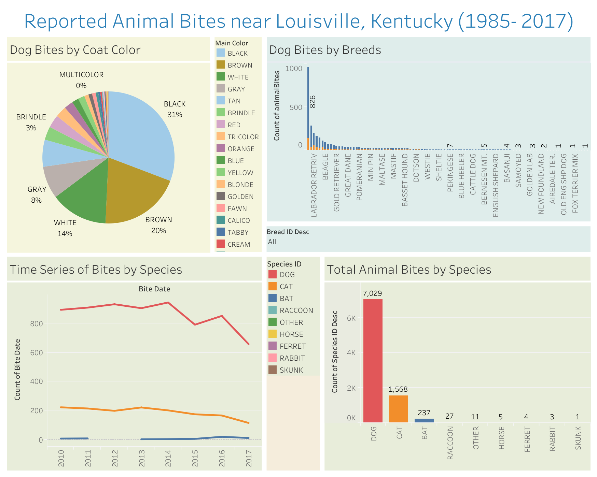

# Recorded Animal Bites

## Table of contents
* [About](#about)
    * [Motivation](#motivation)
    * [What I Learned](#what-i-learned) 
* [Data Dashboard](#dashboard)
    * [Analysis Summary](#analysis-summary)
* [Dataset](#dataset)
* [Contact](#contact)

## About

As an aspiring data scientist, I wanted to learn more about the industry-standards for data analysis techniques. I have prior experience using JavaScript and Excel/Sheets; however, companies heavily rely on programs such as Python, R, and Tableau to complete their analyses and dashboards. 

I created the same plots using multiple programs to broaden my skill set and understand the difference between the two. I created this using Tableau Desktop 2024.1 

You can view the final version of my [Data Dashboard](https://public.tableau.com/views/animalBites/Dashboard1?:language=en-US&publish=yes&:sid=&:redirect=auth&:display_count=n&:origin=viz_share_link) here. 

### Motivation
When I went to [Kaggle](https://www.kaggle.com/) to look for a beginning dataset to use, I wanted to start with a topic that I was passionate about. I've always been interested in the unique traits found in different dog breeds. I found a dataset about reported animal bites which allowed me to look into some of the more negative traits found in animals.

### I Learned How To:

* Design an aesthetically-pleasing dashboard and publish it online,

* Connect to different data sources such as Excel and Google Sheets,

* Create a variety of charts including stacked bar charts, line charts, and pie charts, 

* Filter data using sets and groups,

* Tell a story through the narrative of the dataset, and

* Use dashboard actions to create custom, interactive dashboards.

## Dashboard

### Analysis Summary

I would like to summarize and highlight a few key points from this dataset and data analysis:

* **Species:** Though it may be obvious that dogs and cats are more likely to be the cause of reported animal bites since they are the most popular domesticated animals, I was surprised to see Bats at number 3 for reported bites, followed by racoons, horses and ferrets.

* **Timeline:** For the most part, the timeline of animal bites were similar between different species. An increase in 2014 followed by a drop in 2015, increase in 2016 followed by a drop in 2017. The differences in peaks is where the graph is interesting, specifically 2012. There is no reported bat bites (unlike the other years), dog bites increase, and cat bites decrease. 

* **Breed:** Pitbull, German Shepard, and Labrador Retrievers are the 3 dog breeds with the most reported total bites, location of bite does not matter. Pitbulls have 2.25x more reported bites compared to any other breed. 

* **Coat Color:** As far as coat colors go, the most bites have been done by animals with Black, Brown, White, Gray and Tan coats, respectively. Animals with a black coat make up more than 25% of animal bites, and Black and Brown together make up nearly 50% of total bites. 

## Dataset
Dataset was provided by [Kaggle](https://www.kaggle.com/datasets/rtatman/animal-bites/data). 

This dataset contains 9,003 rows with 10 columns where each row is one animal bite incident. The 10 columns presented each bites location and date but also included animal information such as species, breed, color, etc. 

## Contact

Nanor Asadourian - nanor.asadourian@gmail.com
